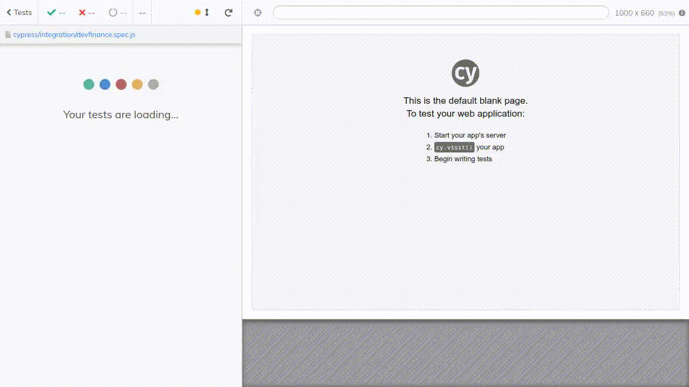

# Workshop EBAC - Cypress

Workshop apresentado no dia 3 e 4 de novembro de 2021, com participação do Samuel Lucas



## Links

- [Github Samuel Lucas](https://github.com/samlucax)

- [Mapa Neural do Cypress](https://github.com/samlucax/cypress-essencial-mindmap)

  - Guia visual e direto ao ponto para quem deseja aprender, consultar ou explicar sobre o cypress

- [Checklist de aprendizado do Cypress](https://github.com/samlucax/cypress-learning-checklist)

  - Lista com comandos do Cypress organizados por ordem de prioridade. O critério adotado para essa priorização foi a frequência de uso destes comandos.

## Etapas do workshop

- Inicie o projeto com os comandos abaixo para inicializar o package.json e adicionar a lib do cypress como devDependencies

```
yarn init --yes
yarn add -D cypress@8.5.0
```

- Execute o comando **open** do cypress pela primeira vez para criar as pastas padrões da lib

```
yarn cypress open
```

- Remova as pastas de exemplo dentro de **cypress/integration**

- Dentro de **cypress/integration** crie os arquivos de testes

- Neste Workshop, será realizado a criação de testes a partir de uma aplicação chamada devFinances, localizada em https://devfinance-agilizei.netlify.app

- Com o arquivo de testes criado, execute o comando `yarn cypress open` caso não esteje com o mesmo aberto e clique no arquivo criado que agora está listado.

- Ele irá iniciar a execução do teste, e o mesmo é esperado que seja concluído sem erros.

- É possível executar os testes também em segundo plano com o comando `yarn cypress run`, com um adicional que é a criação de um vídeo do teste rodando. O(s) vídeo(s) criado(s) fica(m) em **cypress/videos**
